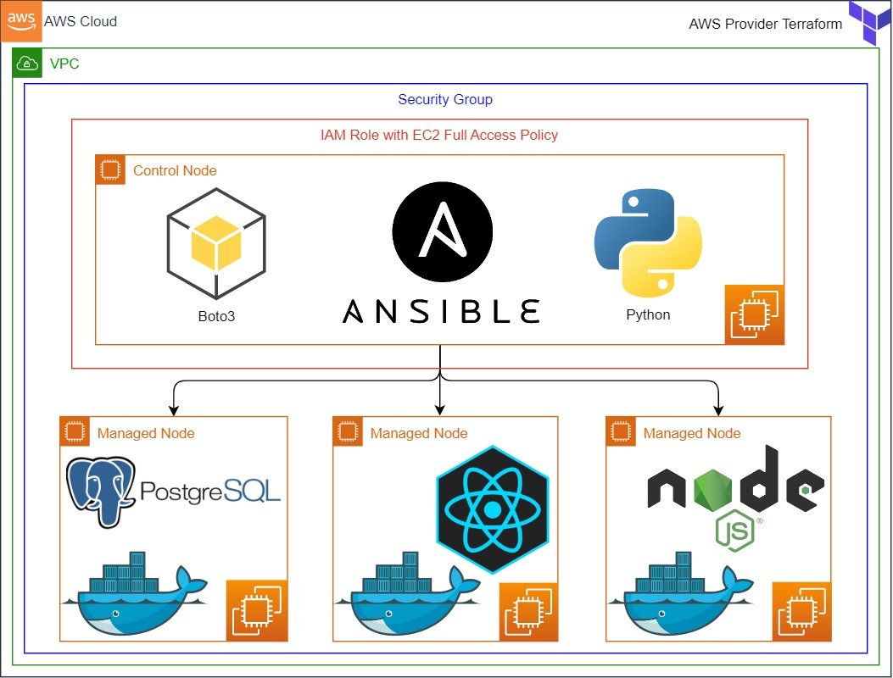

<h1 align="center">
Microservice-Based Web Application deployed on AWS with Terraform, Ansible and Docker
</h1>

<div align="center">

  
  
  
  
  
   
  
  <!--  -->
  <!--  --> 
</div>

<p align="center">
  <a href="#dart-about">About</a> &#xa0; | &#xa0; 
  <a href="#-project-architecture">Project Architecture</a> &#xa0; | &#xa0;
  <a href="#rocket-technologies">Technologies</a> &#xa0; | &#xa0;
  <a href="#white_check_mark-requirements">Requirements</a> &#xa0; | &#xa0;  
  <a href="#-Case-Study-Details">Case Study Details</a> &#xa0; | &#xa0;
  <a href="#memo-license">License</a> &#xa0; | &#xa0;
  <a href="https://github.com/devenes" target="_blank">Author</a>
</p>

## :dart: About ##

Microservice-Based Web Application aims to deploy web-page written Nodejs and React Frameworks on AWS Cloud Infrastructure using Ansible. Building infrastructure process is managing with control node utilizing Ansible. This infrastructure has 1 control node and 3 EC2's as worker node. These EC2's will be launched on AWS console. Web-page has 3 main components which are postgresql, nodejs, and react. Each component is serving in Docker container on EC2s dedicated for them. Postgresql is serving as Database of web-page. Nodejs controls backend part of web-side and react controls frontend side of web-page. The code was written by Devenes and architecture will be created by Devenes.

## 📜 Project Architecture ##



## :rocket: Technologies ##

The following tools were used in this project:

- [Docker](https://www.docker.com/)
- [Javascript](https://developer.mozilla.org/en-US/docs/web)
- [React.js](https://reactjs.org/)
- [Node.js](https://nodejs.org/)
- [Ansible](https://www.ansible.com/)
- [AWS](https://aws.amazon.com/)
- [PostgreSQL](https://www.postgresql.org/)
- [Git](https://git-scm.com/)
- [Github](https://github.com/)
- [Terraform](https://www.terraform.io/)

## :white_check_mark: Requirements ##

Before starting :checkered_flag:, you need to have [Git](https://git-scm.com), [Node](https://nodejs.org/en/), [Docker](https://www.docker.com/), [Terraform](https://www.terraform.io/), [Ansible](https://www.ansible.com/), [React](https://reactjs.org/) and [AWS account](https://aws.amazon.com/).

## 💼 Case Study Details ##

- Your team has recently ended up a project that aims to serve as web page. You and your colleagues are assigned to work on this project. Developer team has done with code and DevOps team is going to deploy the app in production environment using ansible.

- Application is coded by Fullstack development team and given you as DevOps team. Web-page allows users to collect their infos. Registration data should be kept in separate PostgreSQL database located in one of EC2s. Nodejs framework controls backend and serves on port 5000, it is als connected to the PostgreSQL database on port 5432. React framework controls the frontend and it is also connected to the Nodejs server on port 5000. React server broadcasts web-page on port 80. 

- The Web Application will be deployed using Nodejs and React framework.

- The Web Application should be accessible via web browser from anywhere on port 80.

- EC2's and their security groups should be created on AWS console.

- Security groups should be attached to EC2's with at least permission rule.

- The rest of the process has to be controlled with control node which is connected SSH port.

- Codes written by developers and should be pulled from repository into the control node and sent them to the EC2's from here with Ansible.

- Postgresql, Nodejs and React parts has to be placed in docker container. 

- Your project manager wants the DevOps team to launch an EC2 for each postgresql, nodejs and react docker container. In addition, he asks to write three different playbook groups for this project. 
    - First one is to write playbook to control all process for each worker instance separately. 
    - Second one is to control all process in one playbook without using roles.
    - Third one is to control all process in one playbook using roles

In the architecture, you can configure your architecture with these conditions,

  - All process has to be controlled into the `control Node`

  - Dynamic inventory has to be used for inventory file.

  - Ansible config file has to be placed in control node.
  
  - Docker should be installed in all worker nodes using ansible.

  - File should be pulled from Github Repo at the beginning.

  - For PostgreSQL worker node

    - PostgreSQL files (`Dockerfile` and `init.sql`) should be sent into it from control node using ansible

    - Docker image should be created for PostgreSQL container and init.sql file should be placed under necessary folder.

    - Create PostgreSQL container. Do not forget to set password as environmental variable. This password has to be protected with ansible vault.

    - Please make sure this instance's security group should be accept traffic from PostgreSQL's dedicated port from Nodejs EC2 and port 22 from anywhere.

    - To keep database's data, volume has to be created with docker container and necessary file(s) should be kept under this file.

  - For Nodejs worker node

    - Please make sure to correct or create `.env` file under `server` folder based on PostgreSQL environmental variables
    
    - Nodejs's `server` folder should be sent into it from control node using ansible. This file will use for docker image. You don't need any extra file for creating Nodejs image.

    - Docker image should be built for Nodejs container

    - Create Nodejs container and publish it on port 5000

    - Please make sure this instance's security group should be accept traffic from 5000, 22 dedicated port from anywhere.

  - For React worker node

    - Please make sure to correct `.env` file under `client` folder based on Nodejs environmental variables 
    
    - React's `client` folder should be sent into it from control node using ansible. This file will be used for docker image. You don't need any extra file for creating react image.

    - Docker image should be created for React container

    - Create React container and publish it on port 80

    - Please make sure this instance's security group should be accept traffic from 80, and 80 dedicated port from anywhere.
  
## Expected Outcome


- ### Check the status of containers on managed nodes

```bash
ansible all -m shell -a "docker ps -a"
```


- ### API Usage: Add todo using POST method
<!-- > curl -X POST -H "Content-Type: application/json" -d '{"title":"Todo Title", "description":"Todo Description"}' http://nodejsserver:5000/todos -->

> Replace your Node.js server DNS address and port number

```bash
curl --request POST \
--url 'http://3.90.229.142:5000/todos' \
--header 'content-type: application/json' \
--data '{"description":"Learn Ansible"}'
```

### At the end of the project, following topics are to be covered;

- Ansible playbook preparation without roles

- Ansible playbook preparation with roles.

- Bash scripting

- AWS Security groups create and attach to EC2.

- Launch EC2 and it's configurations

- Write dockerfile for postgresql, nodejs and react images.

- Docker image creation for postgresql, nodejs and react containers with ansible playbook

- Docker container launching using created image with ansible playbook

- Git & Github for Version Control System

### At the end of the project, you will be able to;

- Write Ansible playbook in different ways which are without Roles and with Roles

- Apply web programming skills, importing packages within Nodejs and React Frameworks

- Write Dockerfiles for different environments

- Create containers which use React, Nodejs and PostgreSQL docker images 

- Configure connection to the `PostgreSQL` database.

- Connect backend server to database

- Configure Nodejs Framework

- Connect frontend server to backend server

- Configure React Framework for development environment

- Configure React Framework for production environment

- Demonstrate bash scripting skills using `Ansible playbook` to setup web-page on EC2 Instance.

- Apply git commands (push, pull, commit, add etc.) and Github as Version Control System.

## 📚 Resources

- [Ansible Documentation Framework](https://docs.ansible.com/ansible/2.5/user_guide/index.html)

- [AWS CLI Command Reference](https://docs.aws.amazon.com/cli/latest/index.html)

- [Terraform Documentation](https://www.terraform.io/docs/commands/index.html)

- [React Documentation](https://reactjs.org/docs/getting-started.html)

- [Nodejs Documentation](https://nodejs.org/en/docs/)

- [PostgreSQL Documentation](https://www.postgresql.org/docs/9.6/static/index.html)

## :memo: License ##

This project is under license from Apache. For more details, see the [LICENSE](LICENSE) file.


Made with :heart: by <a href="https://github.com/devenes" target="_blank">devenes</a>

&#xa0;

<a href="#top">⬆️ Back to top</a>
